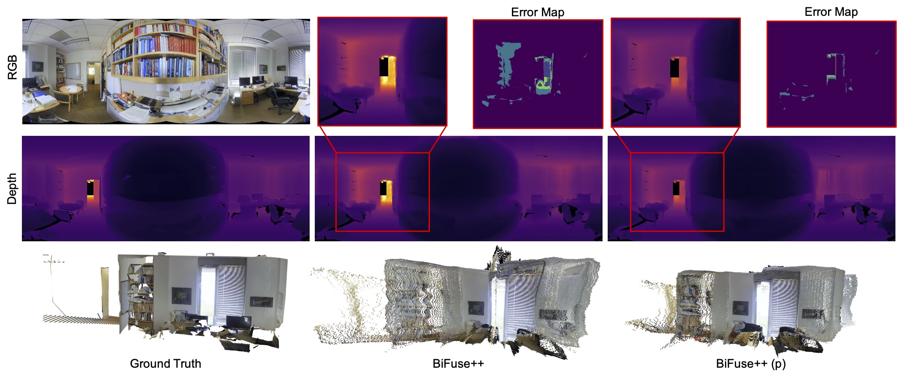

# Depth Anywhere: Enhancing 360 Monocular Depth Estimation via Perspective Distillation and Unlabeled Data Augmentation - Neurips 2024
[arXiv](https://arxiv.org/abs/2406.12849) | [Project Page](https://albert100121.github.io/Depth-Anywhere/) | [Demo](https://huggingface.co/spaces/Albert-NHWang/Depth-Anywhere-App) | [Video](https://nips.cc/virtual/2024/poster/94862) | [Poster](https://nips.cc/virtual/2024/poster/94862)

<a href="https://arxiv.org/abs/2406.12849"></a> <a href='https://albert100121.github.io/Depth-Anywhere/'></a> [](https://huggingface.co/spaces/Albert-NHWang/Depth-Anywhere-App) <a href='https://huggingface.co/papers/2406.12849'></a>


This is the official implementation of Depth Anywhere, a project that proposes cross-camera model knowledge distillation by leveraging the large amount of perspective data and the capabilities of perspective foundation depth models.


[Depth Anywhere: Enhancing 360 Monocular Depth Estimation via Perspective Distillation and Unlabeled Data Augmentation](https://albert100121.github.io/Depth-Anywhere/)\
[Ning-Hsu Wang](http://albert100121.github.io/), [Yu-Lun Liu](https://yulunalexliu.github.io/)<sup>1</sup> \
<sup>1</sup>[National Yang Ming Chiao Tung University](https://www.nycu.edu.tw/nycu/en/index)




#### News
- **Sep, 26, 2024**: Paper accepted to Neurips 2024
- **Jun, 24m 2024**: Hugging Face demo released

## Usage
### Environment installation
- If you only need to run our code, we have a simplified environment installation as follows.
    ```bash
    conda create --name depth-anywhere python=3.8
    conda activate depth-anywhere
    pip install -r requirements.txt
    ```

- If you plan to train with a different teacher or student model, you can set up the environment in three steps:
    1. Create you conda environments
    ```bash
    conda create --name depth-anywhere python=3.8
    conda activate depth-anywhere
    ```
    2. Install the environments of your perspective foundation model (we take [Depth Anything](https://github.com/LiheYoung/Depth-Anything) as an exampler)
    ```bash
    git clone https://github.com/LiheYoung/Depth-Anything
    cd Depth-Anything
    pip install -r requirements.txt
    ```
    3. Install the 360 depth baseline model (We take [UniFuse](https://github.com/alibaba/UniFuse-Unidirectional-Fusion) as an example)
    ```bash
    cd baseline_models
    git clone https://github.com/alibaba/UniFuse-Unidirectional-Fusion.git
    pip install -r requirements.txt
    ```

    
### Pretrained weights
You can download checkpoints from [link](https://drive.google.com/file/d/1yE555x5tvC3zJx_KxyuMKi4ok-joKpdg/view?usp=sharing) and place them under checkpoints as mentioned in [checkpoints/README.md](checkpoints/README.md).

### How to run

#### Inference

For model inferernce
```bash
python inference.py \
    --input_dir [Path to you input dir, default: data/examples/sf3d] \
    --pretrained_weight [Path to your checkpoint .pth file]\
    --output_dir [Path you would like to store your output files, default: outputs]
```

#### Training

1. **Data Preparation**
    In order to reproduce the paper setting, you will need to download the following datasets under `data/`. We follow the official split for these datasets.
    - [Matterport3D](https://niessner.github.io/Matterport/)
    - [Stanford2D3D](https://github.com/alexsax/2D-3D-Semantics)
    - [Structured3D](https://structured3d-dataset.org/)

2. **Model Training**
    For model training, we follow the training settings of all baseline_model in our paper for a fair comparison. **Feel free to tune the hyperparameters or change the student/teacher models to achieve superior results.**

    We put example config files of four models used in our paper under `config/`
    - [UniFuse](https://github.com/alibaba/UniFuse-Unidirectional-Fusion)
    - [BiFuse++](https://github.com/fuenwang/BiFusev2/tree/3c436aa848bd95848b2ff250cadd14e90e82f35c/BiFusev2)
    - [HoHoNet](https://github.com/sunset1995/HoHoNet)
    - [EGformer](https://github.com/yuniw18/EGformer)
    
    To run the training script:
    ```bash
    python train.py --config [Path to config file]
    ```

### Citation
```
@article{wang2024depthanywhere,
  title={Depth Anywhere: Enhancing 360 monocular depth estimation via perspective distillation and unlabeled data augmentation},
  author={Wang, Ning-Hsu and Liu, Yu-Lun},
  journal={Advances in Neural Information Processing Systems},
  volume={37},
  year={2024}
}
```


#### Acknowledgement
**We sincerely appreciate the following research / code / datasets that made our research possible**

- [Depth Anything](https://github.com/LiheYoung/Depth-Anything/tree/main)
- [UniFuse](https://github.com/alibaba/UniFuse-Unidirectional-Fusion)
- [BiFuse++](https://github.com/fuenwang/BiFusev2)
- [EGFormer](https://github.com/yuniw18/EGformer)
- [HoHoNet](https://github.com/sunset1995/HoHoNet)
- [py360converter](https://github.com/sunset1995/py360convert)

